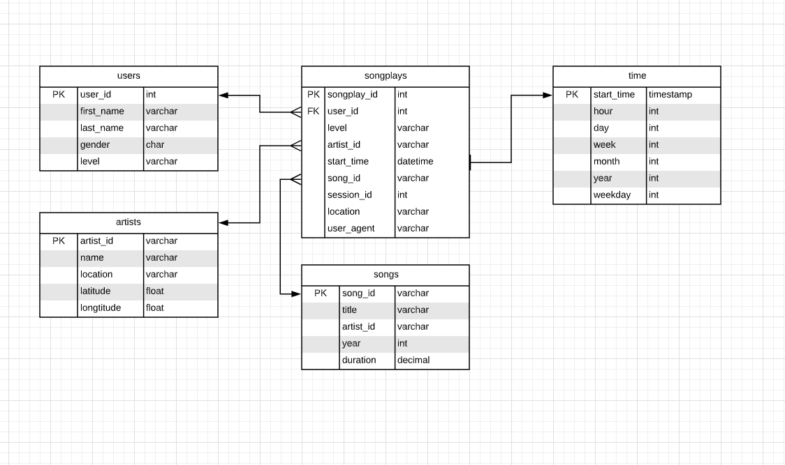

# PROJECT: Data Modelling with Postgres
# Summary

Sparkify database provides users with information on users, artist and the songs the users are listening to

* **./data/song_data: static data about artists and songs
* **./data/log_data: event data of a music streaming app  e.g. users listening to what song, when, where

**Project contains two scripts:**

* **create_tables.py**: This script drops existing tables and creates new ones.
* **etl.py**: This script takes data from ./data/song_data and ./data/log_data and inserts it into DB.

## About Database

Sparkify analytics database (called here sparkifydb) schema has a star design. Start design means that it has one Dimension Table having business data, and supporting Fact Tables. Dimension Table answers one of the key questions: what songs users are listening to. DB schema is the following:

_*SparkifyDB schema in ER Diagram.*_

### Fact Table

* **songplays**: song play data together with user, artist, and song info (songplay_id, start_time, user_id, level, song_id, artist_id, session_id, location, user_agent)

### Dimension Tables

* **users**: user info (columns: user_id, first_name, last_name, gender, level)
* **songs**: song info (columns: song_id, title, artist_id, year, duration)
* **artists**: artist info (columns: artist_id, name, location, latitude, longitude)
* **time**: detailed time info about song plays (columns: start_time, hour, day, week, month, year, weekday)

## HOWTO use
Run create_tables.py by executing the following statement:

`python3 create_tables.py`

Run etl.py by executing the following statement:

`python3 etl.py`
